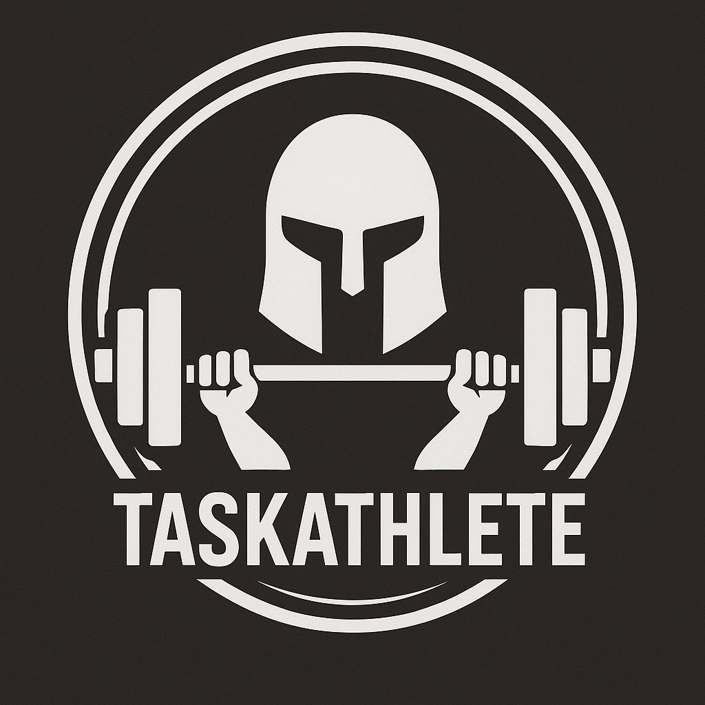

# TaskAthlete



> A command-line interface tool to track workouts, exercises, and fitness statistics.

TaskAthlete is designed for fitness enthusiasts and athletes who prefer managing their training logs directly from the terminal. It allows you to define exercises, log workouts with details like sets, reps, weight, duration, and distance, manage exercise aliases, view workout history, calculate statistics, and monitor personal bests. Data is stored locally in a SQLite database and configuration is managed via a TOML file.

**Disclaimer:** TaskAthlete is an independent project inspired by the concepts and user experience of the excellent [Taskwarrior](https://taskwarrior.org/) task management tool. However, **TaskAthlete is not affiliated with, endorsed by, or otherwise associated with the official Taskwarrior project.** It focuses specifically on workout tracking.


## Table of Contents

*   [Features](#features)
*   [Installation](#installation)
*   [Usage](#usage)
    *   [Getting Help](#getting-help)
    *   [Basic Examples](#basic-examples)
*   [Commands Overview](#commands-overview)
    *   [Exercise Definition](#exercise-definition)
    *   [Workout Entry](#workout-entry)
    *   [Alias Management](#alias-management)
    *   [Statistics & Volume](#statistics--volume)
    *   [Configuration Commands](#configuration-commands)
    *   [Utility](#utility)
*   [Global Options](#global-options)
*   [Key Concepts](#key-concepts)
    *   [Aliases](#aliases)
    *   [Units (Metric/Imperial)](#units-metricimperial)
    *   [Bodyweight Exercises](#bodyweight-exercises)
    *   [Personal Bests (PBs)](#personal-bests-pbs)
    *   [Streaks](#streaks)
    *   [Volume](#volume)
    *   [Date Input](#date-input)
*   [Configuration File (`config.toml`)](#configuration-file-configtoml)
*   [Database File (`workouts.sqlite`)](#database-file-workoutssqlite)
*   [Shell Completion](#shell-completion)
*   [Building from Source](#building-from-source)
*   [Contributing](#contributing)
*   [License](#license)

## Features

*   **Define Exercises:** Specify exercise type (Resistance, Cardio, BodyWeight) and target muscles.
*   **Log Workouts:** Record sets, reps, weight, duration, distance, notes, and the date of your workout.
*   **Flexible Date Input:** Use 'today', 'yesterday', or standard date formats (YYYY-MM-DD, DD.MM.YYYY, YYYY/MM/DD).
*   **Bodyweight Exercise Handling:** Automatically incorporates your configured bodyweight for BodyWeight exercises (adds configured bodyweight + any additional weight specified).
*   **History & Filtering:** List and filter workout history by exercise, date, type, or muscle.
*   **Nth Last Day View:** List workouts for the Nth most recent day a specific exercise was performed.
*   **Edit & Delete:** Modify or remove exercise definitions and workout entries.
*   **Exercise Aliases:** Create short, memorable aliases for exercises (e.g., `bp` for "Bench Press").
*   **Detailed Statistics:** View stats for any exercise, including total workouts, date range, average frequency, longest gap, streaks, and personal bests.
*   **Workout Volume:** Calculate and display training volume (Sets \* Reps \* Weight) per day/exercise.
*   **Personal Best Tracking:** Automatically identifies and optionally notifies you about new PBs for weight, reps, duration, and distance.
*   **Configurable PB Notifications:** Enable/disable PB notifications globally and per specific metric.
*   **Configurable Units:** Choose between Metric (kg/km) and Imperial (lbs/miles) for weight and distance input/display.
*   **Configurable Streaks:** Define the maximum gap (in days) allowed between workouts to maintain a streak.
*   **CSV Export:** Export workout lists, exercise definitions, aliases, stats, and volume data using the `--export-csv` flag.
*   **Shell Completion:** Generate completion scripts for Bash, Fish, Zsh, PowerShell, and Elvish.
*   **Simple Configuration:** Settings managed via a user-friendly TOML file.
*   **Local Data:** All data stored locally in a SQLite database.

## Installation

### Building from Source

1.  **Clone the repository:**
    ```bash
    git clone <repository-url> # Replace with the actual URL
    cd taskathlete # Or the actual repository directory name
    ```
2.  **Build the release binary:**
    ```bash
    cargo build --release
    ```
3.  **Find the executable:** The binary will be located at `./target/release/taskathlete`.
4.  **Copy to your PATH (Optional):** Copy the executable to a directory included in your system's `PATH` (e.g., `~/.local/bin/` or `/usr/local/bin/`) for easier access.
    ```bash
    cp ./target/release/taskathlete ~/.local/bin/
    # or
    sudo cp ./target/release/taskathlete /usr/local/bin/
    ```

## Usage

### Getting Help

Get a list of all commands:
```bash
taskathlete --help
```

Get help for a specific command (e.g., `add`):
```bash
taskathlete add --help
```

### Basic Examples

1.  **Define a new exercise:**
    ```bash
    taskathlete create-exercise -n "Barbell Squat" -t Resistance -m "quads,glutes,hamstrings"
    ```

2.  **Create an alias:**
    ```bash
    taskathlete alias squat "Barbell Squat"
    ```

3.  **Add a workout for yesterday using the alias:**
    ```bash
    taskathlete add -e squat --date yesterday -s 5 -r 5 -w 120.0
    ```

4.  **Add a cardio workout (distance assumed based on config units):**
    ```bash
    taskathlete add -e Running -d 45 -l 8.0 -n "Zone 2 training"
    ```

5.  **Add a bodyweight workout with additional weight:**
    ```bash
    taskathlete add -e "Pull-ups" -s 4 -r 8 -w 5.0 # Adds 5kg/lbs to your configured bodyweight
    ```

6.  **List recent workouts:**
    ```bash
    taskathlete list
    ```

7.  **List workouts for 'Running' performed on 2023-10-27:**
    ```bash
    taskathlete list -e Running --date 2023-10-27
    ```

8.  **Show statistics for 'Barbell Squat':**
    ```bash
    taskathlete stats -e squat
    ```

9.  **Show workout volume for the last 7 days (default):**
    ```bash
    taskathlete volume
    ```

10. **Export the list of defined exercises to CSV:**
    ```bash
    taskathlete list-exercises --export-csv > exercises.csv
    ```

## Commands Overview

*(For full details and options for each command, run `taskathlete <COMMAND> --help`)*

### Exercise Definition
*   `create-exercise`: Define a new exercise type.
*   `delete-exercise`: Delete an exercise definition.
*   `edit-exercise`: Modify an existing exercise definition.
*   `list-exercises`: List defined exercises, with optional filters.

### Workout Entry
*   `add`: Add a new workout log entry.
*   `delete-workout`: Delete a specific workout log entry by ID.
*   `edit-workout`: Modify an existing workout log entry by ID.
*   `list`: List workout log entries, with various filtering options (date, exercise, type, muscle, limit, nth-last-day).

### Alias Management
*   `alias`: Create a short alias for an exercise.
*   `unalias`: Delete an exercise alias.
*   `list-aliases`: List all defined aliases.

### Statistics & Volume
*   `stats`: Show detailed statistics for a specific exercise.
*   `volume`: Calculate and display workout volume (Sets\*Reps\*Weight) over time.

### Configuration Commands
*   `set-bodyweight`: Set your bodyweight in the config (used for BodyWeight exercises).
*   `set-units`: Set default units (Metric/Imperial).
*   `set-pb-notification`: Globally enable/disable PB notifications.
*   `set-pb-notify-weight`/`reps`/`duration`/`distance`: Fine-tune PB notifications per metric.
*   `set-streak-interval`: Configure the time allowed between workouts for streaks.

### Utility
*   `db-path`: Show the path to the database file.
*   `config-path`: Show the path to the configuration file.
*   `generate-completion`: Generate shell completion scripts.

## Global Options

*   `--export-csv`: Output data from `list`, `list-exercises`, `list-aliases`, `stats`, and `volume` commands in CSV format instead of tables.
*   `--help`: Print help information.
*   `--version`: Print version information.

## Key Concepts

### Aliases
Create short names (e.g., `bp` for "Bench Press") for exercises using the `alias` command. You can then use these aliases wherever you'd normally use the full exercise name or ID (in `add`, `list`, `stats`, etc.). Manage them with `unalias` and `list-aliases`.

### Units (Metric/Imperial)
Control how weights (kg/lbs) and distances (km/miles) are handled using `set-units` or the `config.toml`. This affects input interpretation and output display. Distances are always stored internally as kilometers.

### Bodyweight Exercises
For exercises marked as `BodyWeight`, the total weight recorded is calculated as: `Your Configured Bodyweight + Weight Provided with 'add' Command`. Make sure your bodyweight is set using `set-bodyweight` for accurate tracking. If it's not set, you may be prompted when adding a bodyweight workout (unless prompting is disabled).

### Personal Bests (PBs)
TaskAthlete tracks your best recorded:
*   **Weight:** Max weight lifted (Resistance/BodyWeight types).
*   **Reps:** Max repetitions per set.
*   **Duration:** Max duration in minutes.
*   **Distance:** Max distance covered (stored as km).

You can be notified when you achieve a new PB. Use `set-pb-notification` to toggle notifications globally and `set-pb-notify-[metric]` commands for finer control.

### Streaks
The `stats` command shows your current and longest workout streaks for an exercise. A streak continues if the gap between consecutive workouts (for that specific exercise) is no more than the `streak_interval_days` set in your configuration (default: 1 day). Use `set-streak-interval` to adjust this (e.g., 7 for weekly).

### Volume
Workout volume helps gauge training intensity. It's calculated for `Resistance` and `BodyWeight` exercises as: `Sets * Reps * Weight`. (Weight includes configured bodyweight for BodyWeight type). `Cardio` exercises have a volume of 0. Use the `volume` command to view this over time.

### Date Input
When specifying dates (e.g., `--date`), you can use:
*   `today`
*   `yesterday`
*   `YYYY-MM-DD` (e.g., `2023-10-27`)
*   `DD.MM.YYYY` (e.g., `27.10.2023`)
*   `YYYY/MM/DD` (e.g., `2023/10/27`)

## Configuration File (`config.toml`)

TaskAthlete uses a configuration file (`config.toml`) for settings.
*   **Location:** Find the path using `taskathlete config-path`. Defaults usually follow system standards (e.g., `~/.config/workout-tracker-cli/` on Linux). The location can be overridden by setting the `WORKOUT_CONFIG_DIR` environment variable (Note: the directory name `workout-tracker-cli` is based on the code's constants).
*   **Key Settings:**
    *   `bodyweight`: (Float) Your weight for BodyWeight exercise calculations. Set via `set-bodyweight`.
    *   `units`: (String: "metric" or "imperial") Default units. Set via `set-units`.
    *   `prompt_for_bodyweight`: (Boolean) Ask for bodyweight if needed and not set? Default `true`.
    *   `streak_interval_days`: (Integer >= 1) Max days between workouts for a streak. Default `1`. Set via `set-streak-interval`.
    *   `notify_pb_enabled`: (Boolean, optional) Master switch for PB notifications. Set via `set-pb-notification`.
    *   `notify_pb_weight`/`reps`/`duration`/`distance`: (Boolean) Per-metric PB notification toggles. Defaults `true`. Set via `set-pb-notify-*`.
    *   `theme.header_color`: (String) Color name for table headers (e.g., "Green").

## Database File (`workouts.sqlite`)

Your workout data is stored locally in a SQLite database.
*   **Location:** Find the path using `taskathlete db-path`. Defaults usually follow system standards (e.g., `~/.local/share/workout-tracker-cli/` on Linux).

## Shell Completion

Generate command-line completion for your shell:
```bash
# Example for Bash (add to ~/.bashrc or similar)
taskathlete generate-completion bash >> ~/.bash_completion # Adjust path if needed
source ~/.bash_completion

# Example for Fish (save to ~/.config/fish/completions/)
taskathlete generate-completion fish > ~/.config/fish/completions/taskathlete.fish

# Example for Zsh (follow instructions provided by Zsh completion system)
# Often involves placing the output in a directory listed in $fpath
taskathlete generate-completion zsh > /path/to/zsh/completions/_taskathlete
```

## Building from Source

(See [Installation](#installation) section above)

## Contributing

Contributions (bug reports, feature requests, pull requests) are welcome! Please check the project's repository for contribution guidelines. (Link to repository would go here).

## License

MIT
